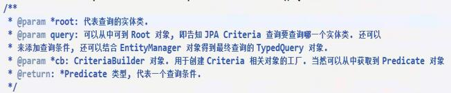
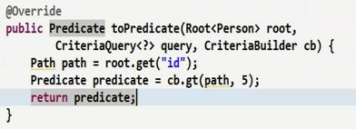

# JPA 
为了简化对数据库的操作
###Repository 接口
1. 接口定义规范
    1. 不是随意定义的的要符合规范
    2. 查询的方法必须以read | find | get 涉及条件要用关键字链接 属性的首字母大写
    3. 支持级联查询默认使用当前类的若没有则使用级联属性
2. 以上支持简单查询如果需要复杂查询就需要使用jpql(不支持insert)
    1. Query 
        1. 传参方式 顺序 ?number 允许添加占位符
        2. @param @query使用:引用
        3. @query中nativeQuery为true为原生sql查询
    2. modifying
        1. CrudRepository 更新数据 
        2. 使用modifying加transactional需要service的支持
    3. PagingAndSortingRepository 分页排序
        1.    PageRequest user_id = PageRequest.of(0, 3, Sort.by(new Sort.Order(Sort.Direction.DESC, "userId")));
    4. PagingAndSortingRepository
    5. JpaSpecificationExecutor
        - Specification  -- toPredicate(Root<T> var1, CriteriaQuery<?> var2, CriteriaBuilder var3) -- 
        
        
3. 自定义repository接口
    1. 定义接口
    2. 实现接口 @PersistenceContext 获取 EntityManager
    3. 使用(extend)         
 
 
---
@JoinColumn与@Column标记一样，是用于注释表中的字段的。它的属性与@Column属性有很多相同之处，这里就不详细讲述。请读者参阅5.2.2小节中有关@Column属性的部分。 

@JoinColumn与@Column相区别的是：@JoinColumn注释的是保存表与表之间关系的字段，它要标注在实体属性上。而@Column标注的是表中不包含表关系的字段。 

与@Column标记一样，name属性是用来标识表中所对应的字段的名称。例如customer表中存在字段addr_id，标识的代码如下所示。 

@OneToOne 

@JoinColumn(name = "addr_id") 

public AddressEO getAddress() { 
    return address;    
} 

若此时，不设置name的值，则在默认情况下，name的取值遵循以下规则： 

name=关联表的名称+“_”+ 关联表主键的字段名 

例如，CustomerEO实体中，如果不指定name的值，默认将对应name=address_id；因为@JoinColumn注释在实体 AddressEO属性上，实体AddressEO对应的表名为“address”；表address的主键是“id”，所以此时对应的默认的字段名称为 “address_id”。 

提示：此规则只适用于与@OneToOne标记同时使用时。若与@ManyToOne或@ManyToMany标记同时使用时，将遵循其他的规则。 

默认情况下，关联的实体的主键一般是用来做外键的。但如果此时不想主键作为外键，则需要设置referencedColumnName属性。例如，将address表中增加一个字段“ref_id”，address表的建表SQL变为以下所示。 

CREATE TABLE address ( 

id int(20) NOT NULL auto_increment, 

ref_id int int(20) NOT NULL, 

province varchar(50) , 

city varchar(50) , 

postcode varchar(50) , 

detail varchar(50) , 

PRIMARY KEY (id) 

) 

此时，通过customer表中的“address_id”字段关联的是address表中的“ref_id”，而“ref_id”并不是address表中的主键，则实体中标注如代码下所示。 

@OneToOne 

@JoinColumn(name = "address_id",referencedColumnName="ref_id") 

public AddressEO getAddress() { 

         return address; 

} 

属性referencedColumnName标注的是所关联表中的字段名，若不指定则使用的所关联表的主键字段名作为外键。 

l         JoinColumn标记不仅能够与@OneToOne使用，也可以@ManyToOne或@ManyToMany标记同时使用，它们所表示的含义不同，这些内容将在下文详细讲述。  